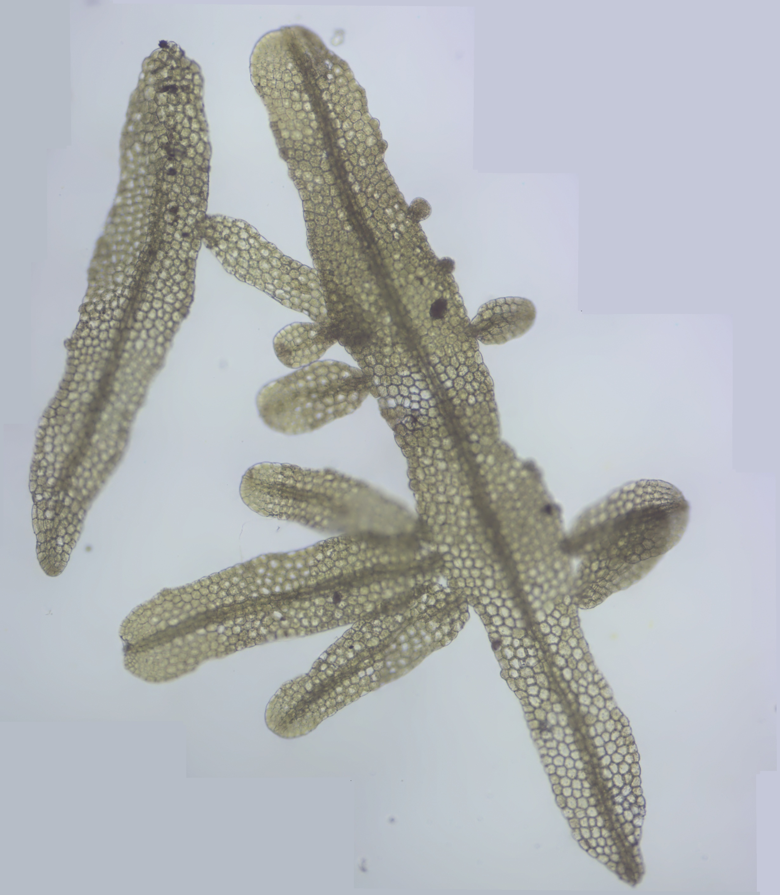

# Stitch: Python Program for Image Stitching

Stitch is a Python program for image stitching. The program uses default values for most options. 

Only the following options are configurable:
- `confidence_threshold`: Confidence level for selecting image matches. Default: `0.5`.
- `try_use_gpu`: Boolean to indicate if GPU should be used. Default: `True`.
- `final_megapix`: Resolution for final stitched image (megapixels). Default: `5`.
- `crop`: Boolean to indicate if cropping should be performed. Default: `False` (not changeable).
- `warper_type`: Type of image warper. Default: `plane` (not changeable).
- `detector`: Feature detector type. Default: `sift` (not changeable).

To change any of these options, add them to the INI file `stitch.ini`:
```
[OPTIONS]
img_dir = ./img
out_dir = ./result
final_megapix = 5
try_use_gpu = True
confidence_threshold = 0.5
output = output
```

# Precondition for Each Program Run

## Directory Structure

1. **Input Directory (`img_dir`, change default in `stitch.ini`)**
   - Path: `./img`
   - Content: JPEG files (`.jpg`) to be stitched into a panorama.

2. **Output Directory (`out_dir` and `output`, change default in `stitch.ini`)**
   - Path: `./result`
   - Filenames produced: `output.jpg` (stitched image before postprocessing) and `outputfixed.jpg` (stitched image after border-fix postprocessing).

Ensure the directories exist and contain the required files before running the program.

# Functionality of the Program

1. **Logging Configuration**
   - Logs to console and to `stitch.log`.
   - Removes the log file if it exceeds 10 MB.

2. **Configuration Reading**
   - Reads options from `stitch.ini` and applies defaults when needed.

3. **Directory and File Handling**
   - Converts relative input/output paths to absolute paths and logs them.
   - Lists input files and logs their full paths.

4. **Image Stitching**
   - Initializes a `Stitcher` object with configured parameters.
   - Uses the stitcher to create a panorama and saves the result.

5. **Post-Processing for Border Removal**
   - Replaces black border pixels with a mean color sampled from non-black border pixels.
   - Saves the post-processed image as `outputfixed.jpg`.

# Libraries Used

- `os` for file and directory operations.
- `numpy` for numerical operations.
- `cv2` (OpenCV) for image processing.
- `logging` for logging messages.
- `configparser` for reading configuration files.

# Installation

## Windows (x64) - Prebuilt Executable
If using the prebuilt package or `stitch.zip`:
1. Extract `stitch.zip` (or locate `dist/stitch.exe`).
2. Ensure `stitch.ini` and the input folder `img/` are in the working directory.

## Windows (x64) - Building from Source
To build `stitch.exe` from the source code:
1. Ensure Python 3 (x64) is installed.
2. Run `stitch.cmd` in the project root directory.
3. The generated executable will be placed in `dist/stitch.exe`.

## Other Platforms (Linux / macOS)
Python source code is cross-platform, but the prebuilt `stitch.exe` binary runs only on Windows (x64). 

For other operating systems:
1. Ensure Python 3.8+ is installed.
2. Install the required dependencies:
   ```bash
   pip install -r requirements.txt
   ```
3. Run or package the application:
   - **Run directly**: `python src/stitch.py`
   - **Build a native executable**: Run PyInstaller on the target operating system:
     ```bash
     pyinstaller --onefile --name stitch src/stitch.py
     ```
# Usage

## Capture Input Images~~

Capture overlapping images covering the subject. Keep the following as consistent as possible:

- Same focus plane (small deviations tolerated)
- Same exposure (automatic correction turned off!!)
- Same color balance (automatic correction turned off!!)

## Create Stitched Image

1. Remove any existing images in `img` and `refimg` if present (execute del.cmd)
2. Copy captured images into `img`.
3. Run `stitch.exe`.

Example: Metzgeria furcata (L.) Dumort.  


# License

This project is licensed under the MIT License - see the [LICENSE](LICENSE) file for details.